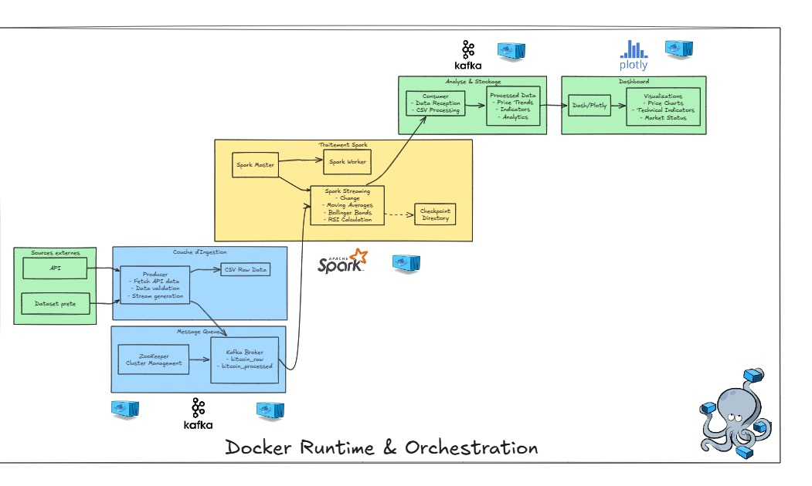

# Bitcoin Analytics Dashboard

[](https://opensource.org/licenses/MIT)
[](https://kafka.apache.org/)
[](https://spark.apache.org/)
[](https://www.python.org/)
[](https://plotly.com/dash/)

## Table of Contents

- [About](#about)
- [Key Features](#key-features)
- [Getting Started](#getting-started)
  - [Prerequisites](#prerequisites)
  - [Installation](#installation)
- [Usage](#usage)
- [Architecture Overview](#architecture-overview)
- [Performance Optimization](#performance-optimization)
- [Contributing](#contributing)
- [License](#license)
- [Contact](#contact)
- [Acknowledgements](#acknowledgements)

## About

The **Bitcoin Analytics Dashboard** is a high-performance, real-time data visualization tool designed to process and analyze Bitcoin market data. Built with **Apache Kafka**, **Apache Spark**, and **Dash**, it provides actionable insights into Bitcoin price trends, technical indicators, and market dynamics. The system is containerized using **Docker** for seamless deployment and scalability.

---


## Architecture Diagram




## Key Features

- **Real-Time Data Streaming**: Leverages Apache Kafka for high-throughput, low-latency data ingestion.
- **Advanced Analytics**: Utilizes Apache Spark for distributed data processing, including moving averages, Bollinger Bands, and RSI calculations.
- **Interactive Visualizations**: Powered by Dash and Plotly for dynamic, real-time charts and graphs.
- **Data Export**: Export processed data to CSV for further analysis.
- **Scalable Architecture**: Designed for horizontal scaling to handle large volumes of data.
- **Dockerized Deployment**: Easy setup and deployment using Docker Compose.

---

## Getting Started

### Prerequisites

Before you begin, ensure you have the following installed:

- **Docker**: [Install Docker](https://docs.docker.com/get-docker/)
- **Docker Compose**: [Install Docker Compose](https://docs.docker.com/compose/install/)

### Installation

1. **Clone the Repository:**

   ```bash
   git clone https://github.com/MouadAH2003/BitcoinRealTimeDashboard.git
   cd BitcoinRealTimeDashboard
   ```

2. **Build and Run the Project:**

   Start all services using Docker Compose:

   ```bash
   docker-compose up --build
   ```

   This command will:
   - Spin up Kafka, Zookeeper, and Spark services.
   - Start the data producer, consumer, and dashboard.

3. **Access the Dashboard:**

   Once the containers are running, open your browser and navigate to:
   ```
   http://localhost:8051/
   ```

---

## Usage

### Dashboard Features

- **Real-Time Price Trends**: Visualize Bitcoin price movements with live updates.
- **Technical Indicators**: View moving averages, Bollinger Bands, and RSI.
- **Data Export**: Download processed data as CSV for offline analysis.

### Stopping the Services

To stop all running containers, use:

```bash
docker-compose down
```

---

## Architecture Overview

The system is built on a robust pipeline architecture:

1. **Data Producer**:
   - Fetches live Bitcoin market data and streams it to a Kafka topic.

2. **Apache Kafka**:
   - Acts as the message broker for real-time data ingestion.

3. **Apache Spark**:
   - Consumes data from Kafka, processes it in real-time, and calculates technical indicators.
   - Writes processed data to CSV files for persistence.

4. **Dash Dashboard**:
   - Fetches data from the processed CSV files and updates the UI in real-time.

---

## Performance Optimization

To ensure high performance and scalability, the following optimizations have been implemented:

- **Kafka Partitioning**: Distributes data across multiple partitions for parallel processing.
- **Spark Tuning**:
  - Adjusted `spark.sql.shuffle.partitions` to optimize shuffle operations.
  - Configured `spark.executor.memory` and `spark.driver.memory` for efficient resource utilization.
- **Checkpointing**: Enabled Spark checkpointing to ensure fault tolerance and state recovery.
- **Docker Resource Limits**: Configured Docker Compose to allocate appropriate CPU and memory resources to each service.

---

## Contributing

Contributions are welcome! If you'd like to contribute, please follow these steps:

1. Fork the repository.
2. Create a new branch (`git checkout -b feature/YourFeatureName`).
3. Commit your changes (`git commit -m 'Add some feature'`).
4. Push to the branch (`git push origin feature/YourFeatureName`).
5. Open a pull request.

---

## License

This project is licensed under the **MIT License**. See the [LICENSE](LICENSE) file for details.

---

## Contact

For questions or feedback, feel free to reach out:

- **Mouad AIT HA**  
  [LinkedIn](https://www.linkedin.com/in/mouad-ait-ha-67427521b/) | mouadaitha@gmail.com

- **Mohamed LAKBAKBI**  
  [LinkedIn](https://www.linkedin.com/in/lakbakbi-mohammed) | mohammedlakbakbi@gmail.com

**Project Link**: [https://github.com/MouadAH2003/BitcoinRealTimeDashboard](https://github.com/MouadAH2003/BitcoinRealTimeDashboard)

---

## Acknowledgements

- **Apache Kafka**: For enabling real-time data streaming.
- **Apache Spark**: For distributed data processing.
- **Dash/Plotly**: For interactive and responsive visualizations.
- **Docker**: For simplifying deployment and scalability.

---

### Docker Compose File (`docker-compose.yml`)

```yaml
version: '3.8'

services:
  zookeeper:
    image: confluentinc/cp-zookeeper:latest
    environment:
      ZOOKEEPER_CLIENT_PORT: 2181
      ZOOKEEPER_TICK_TIME: 2000
    ports:
      - "2181:2181"

  kafka:
    image: confluentinc/cp-kafka:latest
    depends_on:
      - zookeeper
    ports:
      - "9092:9092"
    environment:
      KAFKA_BROKER_ID: 1
      KAFKA_ZOOKEEPER_CONNECT: zookeeper:2181
      KAFKA_ADVERTISED_LISTENERS: PLAINTEXT://kafka:29092,PLAINTEXT_HOST://localhost:9092
      KAFKA_LISTENER_SECURITY_PROTOCOL_MAP: PLAINTEXT:PLAINTEXT,PLAINTEXT_HOST:PLAINTEXT
      KAFKA_INTER_BROKER_LISTENER_NAME: PLAINTEXT
      KAFKA_OFFSETS_TOPIC_REPLICATION_FACTOR: 1
      KAFKA_AUTO_CREATE_TOPICS_ENABLE: "true"

  spark:
    image: bitnami/spark:3.2.0
    environment:
      - SPARK_MODE=master
      - SPARK_RPC_AUTHENTICATION_ENABLED=no
      - SPARK_RPC_ENCRYPTION_ENABLED=no
      - SPARK_LOCAL_STORAGE_ENCRYPTION_ENABLED=no
      - SPARK_SSL_ENABLED=no
    ports:
      - "8080:8080"
      - "7077:7077"
    volumes:
      - ./spark_stream_v2.py:/opt/spark_streaming/spark_stream_v2.py
      - ./spark_checkpoint:/opt/spark_streaming/checkpoint

  spark-worker:
    image: bitnami/spark:3.2.0
    environment:
      - SPARK_MODE=worker
      - SPARK_MASTER_URL=spark://spark:7077
      - SPARK_WORKER_MEMORY=1G
      - SPARK_WORKER_CORES=1
      - SPARK_RPC_AUTHENTICATION_ENABLED=no
      - SPARK_RPC_ENCRYPTION_ENABLED=no
      - SPARK_LOCAL_STORAGE_ENCRYPTION_ENABLED=no
      - SPARK_SSL_ENABLED=no
    depends_on:
      - spark

  spark-submit:
    image: bitnami/spark:3.2.0
    command: >
      bash -c "
      pip install kafka-python pandas numpy &&
      /opt/bitnami/spark/bin/spark-submit 
      --master spark://spark:7077 
      --packages org.apache.spark:spark-sql-kafka-0-10_2.12:3.2.0 
      --conf spark.streaming.kafka.maxRatePerPartition=100
      --conf spark.sql.shuffle.partitions=2
      --conf spark.executor.memory=1g
      --conf spark.driver.memory=1g
      /opt/spark_streaming/spark_stream_v2.py"
    volumes:
      - ./spark_stream_v2.py:/opt/spark_streaming/spark_stream_v2.py
      - ./spark_checkpoint:/opt/spark_streaming/checkpoint
    depends_on:
      - spark
      - kafka

  producer:
    build:
      context: .
      dockerfile: Dockerfile
    volumes:
      - .:/app
    command: python producer.py
    depends_on:
      - kafka

  consumer:
    build:
      context: .
      dockerfile: Dockerfile
    volumes:
      - .:/app
    command: python consumer.py
    depends_on:
      - kafka
      - spark-submit

  dashboard:
    build:
      context: .
      dockerfile: Dockerfile
    ports:
      - "8051:8051"
    volumes:
      - .:/app
    command: python dashboard_2.py
    depends_on:
      - consumer

volumes:
  spark_checkpoint:
```

### Dockerfile

```Dockerfile
FROM python:3.9-slim

WORKDIR /app

# Install required packages for all services
COPY requirements.producer.txt requirements.consumer.txt requirements.dashboard.txt ./

RUN pip install -r requirements.producer.txt \
    && pip install -r requirements.consumer.txt \
    && pip install -r requirements.dashboard.txt

# Copy all Python files and data
COPY *.py ./
COPY *.csv ./

# The specific Python script to run will be specified in docker-compose.yml
CMD ["python"]
```

